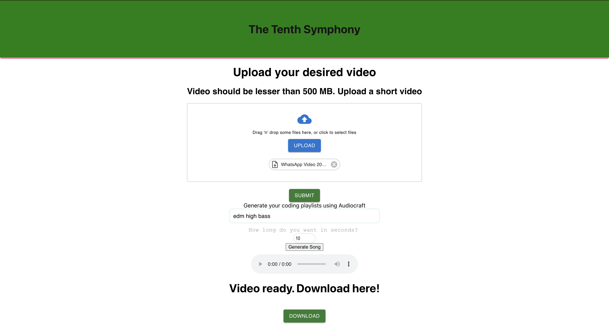
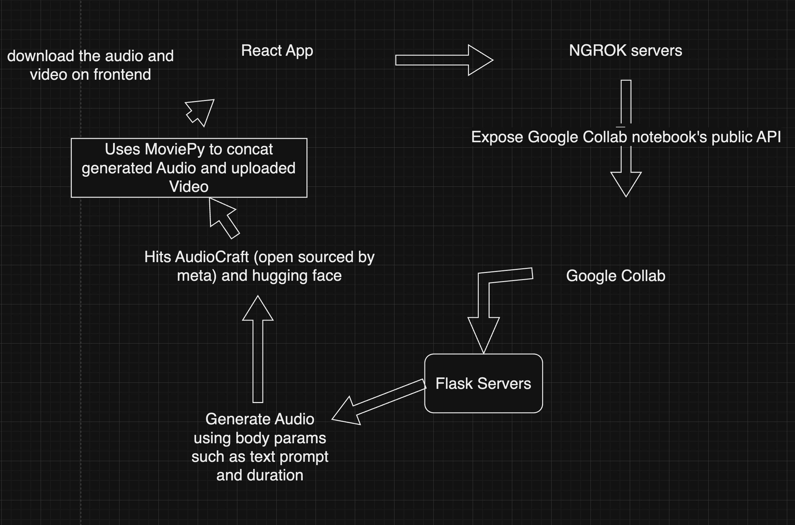

# tenth-symphony
Deep learning project for automatic music generation

https://trello.com/b/JVT4pjvT/the-tenth-symphony

# Components Used - Flask, ngrok, AudioCraft, HuggingFace, React

# AI Generated Music
A full stack web application where user can upload videos and get background music attached to it. It is an AI generated music so no copyright claims are there! 

# dependencies used

1. express - framework
2. nodemon - node server
3. body-parser - body parsing in js
4. cors - cross origin errors
5. react - frontend framework
6. material-ui - react styled components
7. react-material-file-upload - react styled components
8. @mui/icons-material - react styled components
9. react-tinder-card - react styled components
10. flask - backend framework
11. pathlib - interact with filesystem
12. ffmpeg - audio handling
13. transformers - Autoprocessor
14. MusicGenForConditionalGeneration - For Music Generation from AI
15. flask-ngrok - expose public API for google collab
16. moviepy - to concat video and audio
17. flask_cors - handle cors errors
18. audioCraft by meta - facebook's state of the art music generation system

# Routes
1. / - GET
2. /upload - POST
3. /download - GET
4. /playlist_gen - POST
5. /static/<path:path> - GET

# setup
1. clone https://github.com/1709abhishek/TENTH-SYMPHONY
2. cd TENTH-SYMPHONY
3. run npm start to run frontend server
4. open google collab and run ipynb file there
5. login into ngrok and get auth token from there
6. run auth token and save header cell first
7. run cell by cell
8. server up and running
9. copy paste the ngrok link into your react handlers, you're all set!

# Project structure
.

    ├── requirements
        ├── Application of deep learning.pptx
    ├── .gitignore
    ├── tenth-symphony.ipynb       
    ├── frontend
    │   ├── public
    │   ├── src
    |        ├── components
    |            ├── Download.js
    |            ├── Upload.js
                 ├── main.js   
                 ├── App.js   
    ├── Readme.md

# Routes and body Table
Routes | Request Body | Method | Description | Response
|---|---|---|---|---|
| [/] | No | Get | normal landing page  | Yes
| [/upload] | (files) | POST | upload video | Yes
| [/download] | No | GET | download video | Yes
| [/playlist_gen] | (prompt, duration) | POST | enter prompt and duration of music | Yes
| [/static/<path:path>] | No | GET | save audio | Yes